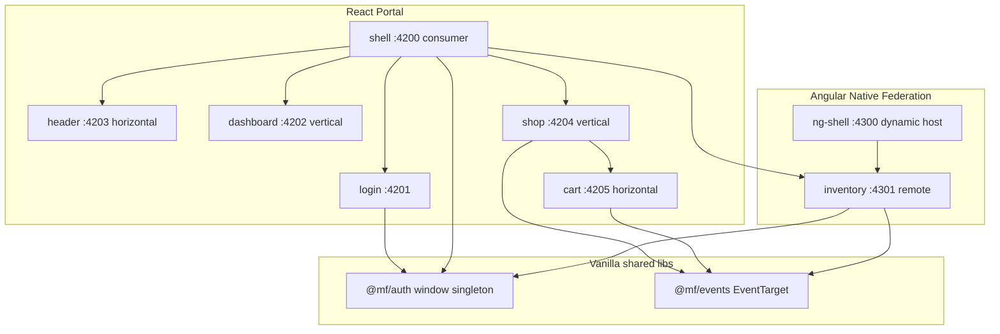

# زیرساخت Module Federation با Nx 23، React 19 و Angular 21

ورک‌اسپیس فعلی خالی است. یک مونورپوی Nx می‌سازیم که **هر دو مدل ترکیب** (vertical و horizontal)، **ارتباط بین ماژول‌ها**، و **SSO سبک با توکن مشترک** را به‌صورت قابل‌اجرا نشان بدهد.

**نسخه‌ها (سپتامبر ۲۰۲۶):**
- Nx `latest` روی خط **23.x** (ژنراتورهای `@nx/react:consumer` / `@nx/react:provider`)
- React **19** (نسخه‌ای که ژنراتور Nx نصب می‌کند)
- Angular **21.2** طبق درخواست شما (آخرین Angular الان 22 است؛ عمداً روی 21 می‌مانیم)
- React: Module Federation رسمی با Vite (`@module-federation/vite` + `@module-federation/runtime`)
- Angular: `@angular-architects/native-federation-v4@21.2.x` — چون از Nx 23 به بعد `@nx/angular:host/remote` deprecated است و در v24 حذف می‌شود

## معماری هدف

یک پورتال واحد (`shell` روی React) کاربر را لاگین می‌کند و بقیه‌ی ماژول‌ها را بر اساس permission توکن لود می‌کند. اکوسیستم Angular جدا با Native Federation هم وجود دارد تا مسیر رسمی Angular دیده شود. ارتباط بین فریم‌ورک‌ها با **Web Component + event bus وانیلی** است، نه Shared React Context / Angular Service — چون دو runtime فدراسیون (Vite MF و Native Federation) نمی‌توانند singleton واقعی بین React و Angular رد و بدل کنند.



## اپ‌ها و نقش هر کدام

| پروژه | فریم‌ورک | نقش federation | split |
|---|---|---|---|
| `apps/shell` | React 19 | consumer | پوسته، روتر، گارد دسترسی، ترکیب افقی/عمودی |
| `apps/login` | React 19 | provider + standalone | صفحه لاگین جدا |
| `apps/dashboard` | React 19 | provider | vertical: کل مسیر `/dashboard` |
| `apps/header` | React 19 | provider | horizontal: هدر روی همه‌ی صفحات احرازشده |
| `apps/shop` | React 19 | provider | vertical: مسیر `/shop` |
| `apps/cart` | React 19 | provider | horizontal: ویجت سبد روی صفحه‌ی shop |
| `apps/ng-shell` | Angular 21 | Native Federation dynamic-host | host رسمی Angular |
| `apps/inventory` | Angular 21 | Native Federation remote + Custom Element | vertical در ng-shell؛ horizontal داخل React shop |

لایبرری‌های مشترک (بدون React/Angular):
- [`packages/shared/contracts`](packages/shared/contracts) — تایپ‌های `AuthUser`, `Permission`, `CartItem`, نام eventها
- [`packages/shared/auth`](packages/shared/auth) — فروشگاه توکن
- [`packages/shared/events`](packages/shared/events) — bus وانیلی

## Scaffold اولیه

داخل پوشه‌ی فعلی (خالی):

```bash
npx create-nx-workspace@latest mf-platform --preset=apps --directory=. --nxCloud=skip
npm i -D @nx/react@latest @nx/angular@latest @nx/vite@latest
```

سپس:
- `nx g @nx/react:consumer apps/shell --bundler=vite --providerNames=login,dashboard,header,shop,cart`
- اپ‌های Angular با `@nx/angular:application` و بعد:

```bash
npm i -D @angular-architects/native-federation-v4@21.2
nx g @angular-architects/native-federation-v4:init --project ng-shell --port 4300 --type dynamic-host
nx g @angular-architects/native-federation-v4:init --project inventory --port 4301 --type remote
```

پورت‌ها ثابت می‌مانند تا `PROVIDERS` و `federation.manifest.json` پایدار باشند. Bundler React را **Vite** می‌گیریم (پیش‌فرض Nx 23 و سریع‌ترین مسیر برای اولین بیس).

## Vertical split در عمل

Shell فقط layout + router است. هر مسیر یک remote کامل است:

- `/login` → `login` (عمومی)
- `/dashboard` → `dashboard` (نیاز به permission `dashboard`)
- `/shop` → `shop` (نیاز به `shop`)
- `/inventory` → Custom Element از Angular `inventory` (نیاز به `inventory`)

لود React با API جدید Nx 23 در [`apps/shell/src/mf.ts`](apps/shell/src/mf.ts): `registerRemotes` + `lazyProvider(alias, 'App')` داخل `ProviderBoundary`. مسیرها با React Router.

لود Angular داخل React: `inventory` علاوه بر expose معمولی Native Federation، یک **Custom Element** با `@angular/elements` ثبت می‌کند (`<mf-inventory>`). Shell اسکریپت remote را لود می‌کند و تگ را رندر می‌کند. این تنها پل پایدار بین دو runtime است.

## Horizontal split در عمل

روی یک صفحه چند remote همزمان:

- همه‌ی صفحات احرازشده: `header` کنار outlet
- صفحه‌ی `/shop`: صفحه‌ی `shop` + ویجت `cart` + ویجت موجودی Angular (`<mf-inventory-widget>`)

Header و Cart مستقل deploy می‌شوند؛ down بودن یکی، بقیه را با error boundary پایین نمی‌آورد.

## ارتباط دو پروژه و رد و بدل دیتا

دو سطح جدا:

**داخل React (همین runtime):** `react` / `react-dom` و در صورت امکان `@mf/auth` و `@mf/events` به‌صورت singleton در config فدراسیون Vite share می‌شوند.

**بین React و Angular (دو runtime):** share فدراسیون کار نمی‌کند. هر دو لایبرری مشترک روی `window` singleton می‌شوند:

```ts
const KEY = '__MF_AUTH__';
export function getAuthStore() {
  if (!window[KEY]) window[KEY] = new AuthStore();
  return window[KEY];
}
```

Event bus مشابه با `EventTarget` روی `window.__MF_BUS__`.

سناریوی دمو:
1. در `shop` روی «افزودن به سبد» کلیک می‌شود → `bus.emit('cart:add', { sku, name, qty })`
2. `cart` گوش می‌دهد، state خودش را عوض می‌کند، تعداد را در UI نشان می‌دهد
3. ویجت Angular `inventory` همان event را می‌گیرد و اگر موجودی کم باشد هشدار می‌دهد
4. `header` تعداد آیتم سبد را از همان bus نشان می‌دهد

یعنی **React shop ↔ React cart** و **React shop ↔ Angular inventory** هر دو کار می‌کنند، بدون وابستگی به Context یا NgRx.

## احراز هویت (ایده‌آل شما)

Login یک **پروژه‌ی مجزا** است: هم remote داخل shell روی `/login`، هم standalone روی `:4201`.

جریان داخل پورتال (حالت اصلی):
1. کاربر بدون توکن به هر مسیری برود → redirect به `/login`
2. فرم لاگین (mock، بدون IdP واقعی در این بیس) یوزر/پس می‌گیرد
3. JWT ساختگی (payload Base64 شامل `sub`, `name`, `permissions`, `exp`) ساخته می‌شود
4. `getAuthStore().login(token)` توکن را در `sessionStorage` می‌نویسد و `auth:changed` پخش می‌کند
5. Shell ناوبری را از روی `permissions` می‌سازد؛ آیتم بدون دسترسی اصلاً دیده نمی‌شود
6. Route guard: اگر URL مستقیم زده شود و permission نباشد → صفحه‌ی 403
7. هر remote موقع mount دوباره `hasPermission(...)` را چک می‌کند (defense in depth)
8. Logout استور را پاک می‌کند، bus را خالی می‌کند، redirect به `/login`

یوزرهای دمو:
- `admin / admin` → همه (`dashboard`, `shop`, `inventory`)
- `shopper / shopper` → فقط `shop` (+ ویجت cart)
- `viewer / viewer` → فقط `dashboard`

حالت standalone لاگین (پورت جدا = origin جدا، پس sessionStorage مشترک نیست): بعد از لاگین redirect به `http://localhost:4200/#access_token=...` و shell توکن را از hash می‌خواند، ذخیره می‌کند، hash را پاک می‌کند. این الگوی رایج BFF/IdP است.

نکته‌ی امنیتی که در README می‌آید: این بیس **mock JWT** است. در پروداکشن توکن httpOnly روی دامنه‌ی مشترک، یا BFF، جای `sessionStorage` را می‌گیرد؛ شکل گاردها و permissionها عوض نمی‌شود.

## فایل‌های کلیدی که بعد از scaffold دستکاری می‌شوند

- [`apps/shell/src/mf.ts`](apps/shell/src/mf.ts) — لیست `PROVIDERS` با URLهای `remoteEntry.js`
- [`apps/shell/src/App.tsx`](apps/shell/src/App.tsx) — روتر + هدر افقی + گارد
- Vite federation `shared: { react, react-dom }` به‌صورت singleton
- [`apps/ng-shell/public/federation.manifest.json`](apps/ng-shell/public/federation.manifest.json) — `{ "inventory": "http://localhost:4301/remoteEntry.json" }`
- `federation.config.mjs` برای `inventory`: expose `./Routes` و `./InventoryElement`

یک target ریشه مثل `nx run serve-all` همه‌ی پورت‌ها را parallel بالا می‌آورد.

## محدوده و چیزهایی که عمداً در این بیس نیست

- IdP واقعی (Keycloak/Auth0) — فقط جای پلاگ مشخص می‌شود
- SSR — ژنراتورهای Nx 23 آن را first-class ندارند
- Webpack قدیمی `@nx/angular/module-federation` — حذف‌شده در Nx 23
- تست E2E کامل — بعد از بالا آمدن، جریان لاگین و سبد را در مرورگر دستی وریفای می‌کنیم

## ترتیب پیاده‌سازی

1. ساخت workspace Nx 23 با preset `apps`
2. لایبرری‌های `@mf/contracts`, `@mf/auth`, `@mf/events`
3. consumer/providerهای React و وصل کردن vertical + horizontal
4. گارد لاگین، توکن، permission، یوزرهای دمو
5. اپ‌های Angular 21 + Native Federation v4
6. Custom Element موجودی داخل صفحه‌ی shop + event bus دوطرفه
7. README اجرا + وریفای مرورگر: لاگین admin/shopper/viewer، سبد، و دسترسی ۴۰۳
